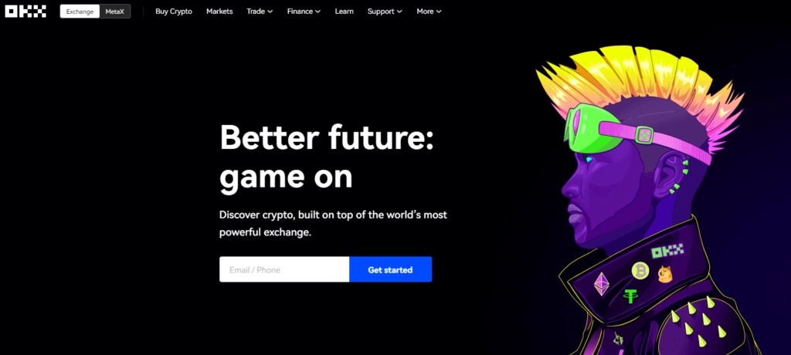
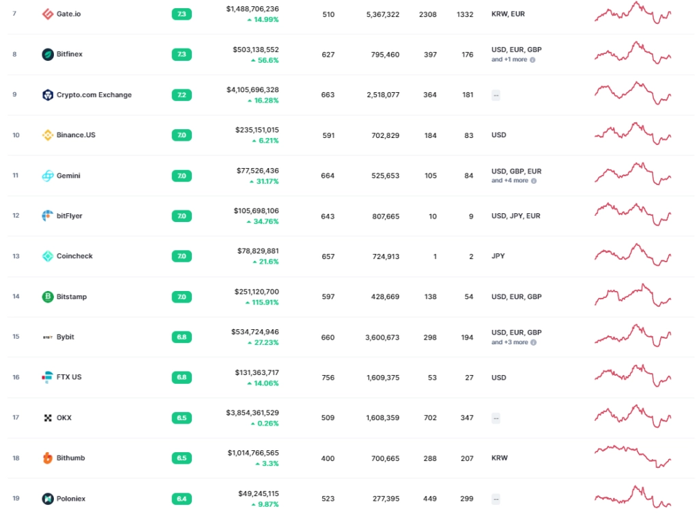
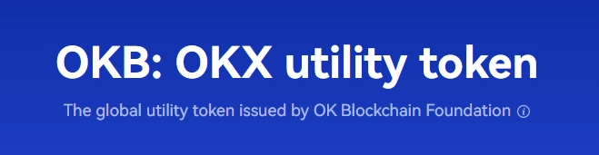
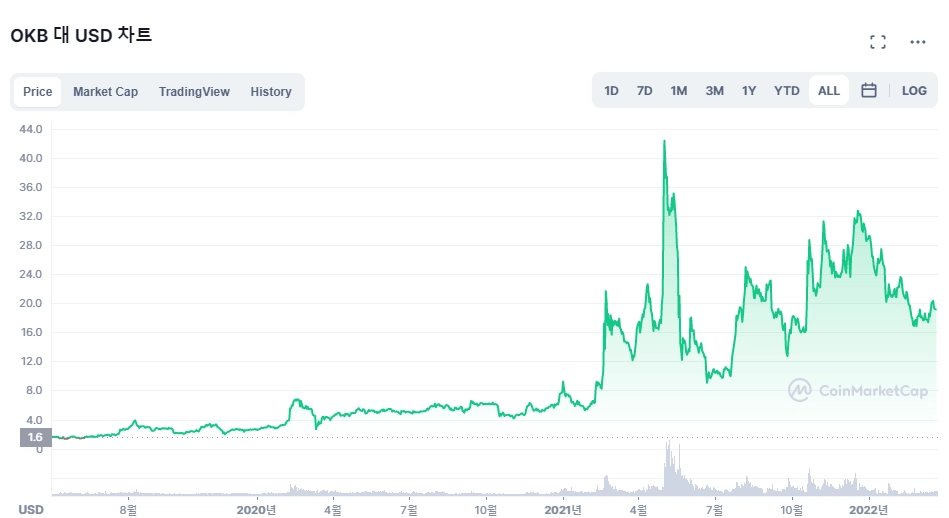
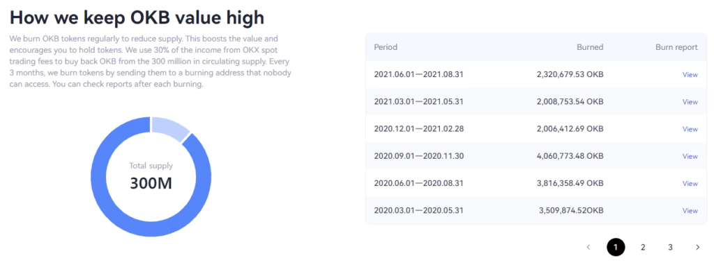
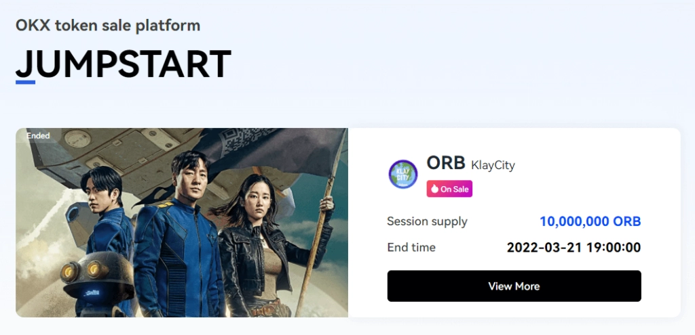
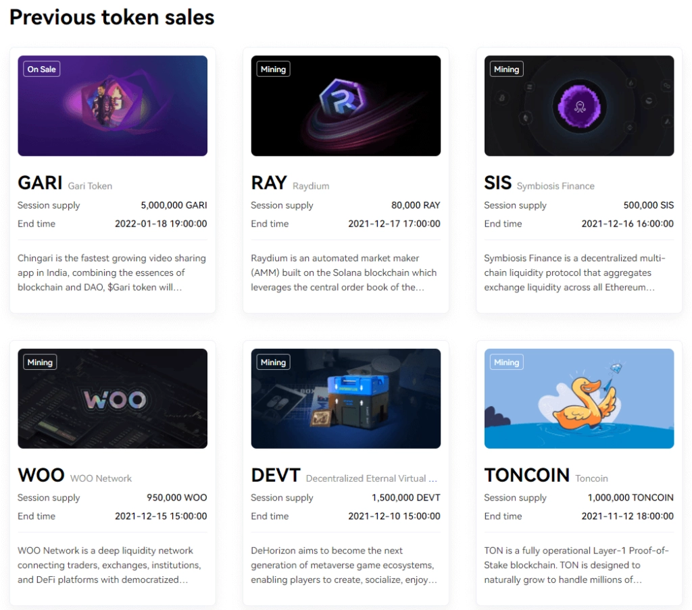
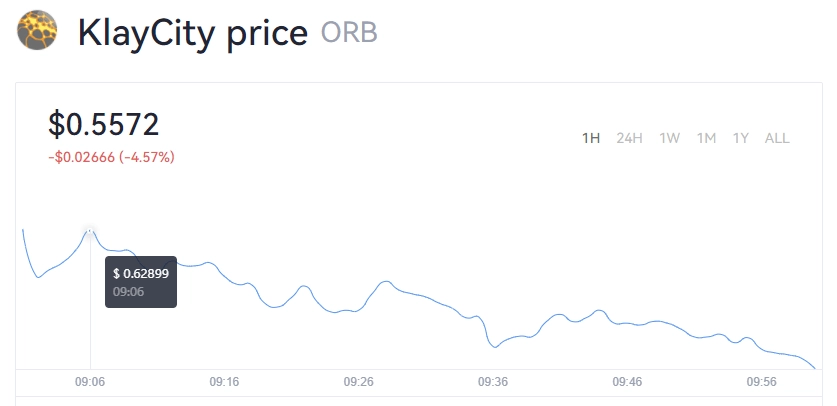

# OKB Coin Analysis: Why OKX Exchange Token Deserves Your Attention

Looking for a crypto exchange token that actually delivers value? OKB from OKX Exchange offers compelling benefits including trading fee discounts, staking rewards, and exclusive access to promising token sales through their Jumpstart program. With consistent token burns and a refreshed platform experience, OKB positions itself as a solid utility token for traders seeking both passive income and early-stage project opportunities.

---

The thing about exchange tokens is, they're not trying to be the next Bitcoin or whatever. They're just... there. Doing their job. Making your trading life easier. And honestly? That's kind of refreshing.

## What's the Deal with OKX Exchange?

So OKX used to be called OKEX. They did this whole rebranding thing, redesigned their website, and basically came back looking way sharper than before. I'd actually forgotten about them for a while, but then they started doing these IEOs (Initial Exchange Offerings) with decent projects, and I was like, "Oh right, these guys."

The platform itself? Pretty smooth now. Not gonna lie, the UI is actually good—clean, fast, doesn't make you want to throw your phone across the room. That's more than I can say for some exchanges out there (looking at you, Gate.io).

Here's the awkward part though: they've slipped in the rankings. Used to be top 10, now they're sitting at #17 according to CoinMarketCap. Even Bybit passed them. Ouch.

But here's the thing—sometimes a good relaunch changes everything. The app experience is genuinely solid now, and that matters more than people think. When you can actually navigate an exchange without wanting to scream, you'll use it more. Simple as that.

One thing some people worry about: it's a Chinese exchange. Me? I don't really care where an exchange is based, as long as it works and doesn't randomly lock my funds. But you know, everyone's got their own risk tolerance.

## OKB Coin: What Actually Makes It Useful

OKB is OKX's utility token. They've got their own mainnet too, but let's be real—unless you're Binance-level massive, your exchange chain probably isn't changing the world. What matters is what you can actually do with the token.

The usual stuff applies:
- **Trading fee discounts** – Save on every trade
- **Staking rewards** – Park your tokens, earn yield
- **Token sales access** – This is the big one

That last point is why people really hold OKB. Getting early access to new token launches can be seriously profitable if the projects are decent.

Looking at the all-time chart, OKB has been surprisingly stable outside of the crazy bull run periods. That's actually one reason I like exchange tokens—they tend to hold their value better than random altcoins. Real business model, real revenue, real burn mechanisms.

### The Token Burns Are Real

Total supply: 300 million OKB. And they're steadily burning tokens with exchange profits. The more the exchange grows, the more they can burn. It's a straightforward deflationary mechanism that actually makes sense—unlike projects that promise burns but never seem to get around to it.

## Jumpstart: The Real Reason to Hold OKB

Alright, this is where it gets interesting. OKX's token sale platform is called Jumpstart, and unlike some exchanges that list literally anything (again, Gate.io...), they actually bring in legitimate projects.

**Requirements to participate:**
- KYC Level 2 verification
- At least $5,000 in trading volume on OKX within 30 days

The trading volume thing is easy—just trade between USDT and USDC or similar stablecoin pairs if you need to hit the threshold.

### Recent Jumpstart Projects

They've launched some solid projects. Most recently they did ORB token from Clay City, which has been pretty hot. Looking at their track record, they're picking projects with actual potential rather than just farming listing fees.

And yeah, the listing pumps are real:

ORB sold at $0.035 in the token sale, then hit around 15x that price after listing. Sure, allocations aren't huge so you're not getting rich off one sale, but consistent returns add up. That's the whole point of these exchange token strategies—👉 [stack steady profits from multiple token sales by holding OKB for Jumpstart access](https://www.okx.com/join/62834398).

## Is OKB Worth Your Money?

Look, here's my take: OKX did a really good job with their platform refresh. I genuinely forgot about them and then came back to find the experience was actually... nice? That doesn't happen often in crypto.

The Jumpstart projects are solid—not moon-shot lottery tickets, but legitimate projects that tend to deliver decent returns. If the exchange keeps this momentum, climbing back up the rankings seems inevitable.

**The Chinese exchange factor** is something to consider. Some people are uncomfortable with that. Fair enough. The play here is to allocate an amount you're comfortable with potentially losing, get your OKB, and start participating in token sales.

New exchanges like MEXC are constantly emerging and growing fast. But that's fine—you don't have to pick just one. Spread your exchange token holdings across multiple platforms. Diversification isn't just for your main portfolio.

The beauty of exchange tokens is they're utility-driven with actual revenue backing them. They get burned. They give you access to launches. They discount your fees. They're not trying to be the next revolutionary blockchain or whatever. Just useful tokens doing useful things.

---

## Wrapping This Up

OKX has quietly rebuilt itself into a competitive exchange with a strong token utility model. OKB offers tangible benefits: fee discounts, staking yields, and most importantly, access to Jumpstart token sales that consistently deliver solid returns. With ongoing token burns and an improved platform experience, OKB represents a practical choice for traders wanting exposure to early-stage projects. If you're building an exchange token portfolio, 👉 [consider adding OKB to access OKX's Jumpstart opportunities](https://www.okx.com/join/62834398).
